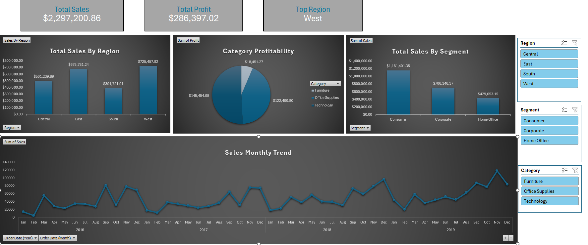

# Superstore_Report_2019

## 📊 Project Overview

An interactive sales analysis dashboard created using **Microsoft Excel** to analyze sales performance, profitability, customer segments, product categories, and regional trends.

The project transforms raw sales data into an interactive dashboard that provides a clear overview of business performance and helps identify important sales trends and patterns.

---

## 🎯 Project Objectives

The main objectives of this project were to:

- Analyze overall sales and profitability.
- Compare sales performance across different regions.
- Analyze sales by customer segment.
- Compare profitability across product categories.
- Identify sales trends over time.
- Create an interactive dashboard for easier data exploration.

---

## 🛠️ Tools & Technologies

- **Microsoft Excel**
- **Pivot Tables**
- **Pivot Charts**
- **Slicers**
- **Excel Data Analysis**

---

## 🔄 Data Preparation

The sales data was prepared and organized in Excel to make it suitable for analysis and dashboard creation.

The preparation process included:

- Reviewing and organizing the dataset.
- Checking and formatting data.
- Preparing the data for Pivot Table analysis.
- Creating the required fields and calculations for reporting.

---

## 📊 Dashboard Features

The dashboard provides an interactive overview of the sales data through several KPIs and visualizations.

### Key Performance Indicators

- **Total Sales:** $2,297,200.86
- **Total Profit:** $286,397.02
- **Top Region:** West

### Visualizations

The dashboard includes:

- **Total Sales by Region**
- **Category Profitability**
- **Total Sales by Segment**
- **Monthly Sales Trend**

### Interactive Filters

Slicers were added to allow users to dynamically filter the dashboard by:

- Region
- Segment
- Category

---

## 📈 Key Insights

The analysis provides insights into:

- The **West region** as the top-performing region by sales.
- Differences in sales performance across the four regions.
- The contribution of different customer segments to total sales.
- Profitability differences across product categories.
- Monthly sales trends and changes over time.

---

## 💡 Business Value

The dashboard provides a simple and interactive way to monitor sales performance and identify important business trends.

It can help business users:

- Monitor key sales and profit KPIs.
- Compare regional performance.
- Understand customer segment contributions.
- Evaluate category profitability.
- Track sales trends over time.

---

## 📷 Dashboard Preview



---

## 📁 Project Structure

```text
Superstore-Sales-Analysis-Excel/
│
├── README.md
│
├── Superstore_Sales_Dashboard.xlsx
│
└── Screenshots/
    └── Superstore_Sales_Dashboard.png
